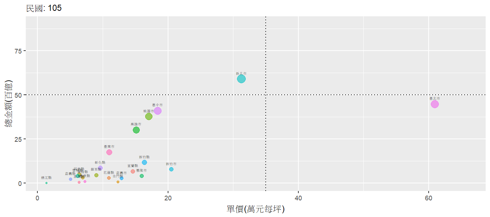

```{r setup, include=FALSE}
library(flexdashboard)

```


總覽(1)
=========================================


Row 
-----------------------------------------------------------------------


### 成交金額統計

```{r ,echo=F,warning=F,error=F,message=F,fig.width=13}

library(tidyverse)
library(skimr)
library(ggplot2)
library(readr)
library(readxl)
library(knitr)
library(kableExtra)
library(DT)
library(ggridges)
library(gganimate)
library(gifski)

# 
# tmp=dir("d:/House",full.names=T,recursive=T,pattern="lvr_land")
#  
#  
# tmp1=tmp[str_detect(tmp,".csv")]
#  
#  
# 
# 
# 
# id=read_csv("d:/house_zip/code_table.csv")
# 
#  
# 
# tmp2=tmp1[!is.na(str_extract(tmp1,"[a-zA-Za-z:0-9_/.]+_[a-z].csv$"))]
#  
# 
# tmp_a=tmp2[!is.na(str_extract(tmp2,"a.csv$"))]
# print(length(tmp_a))
# 
# myall_a=NULL
# 
# for (i in tmp_a){
#  #print(str_extract(i,"[a-z]_lvr"))
#   #print(str_extract(i,"/[A-Za-z][0-9_]+[_0-9a-z]+"))
#   
#   tmpdf=read_csv(i)
#   tmpdf$縣市=id %>% filter(code==str_sub(str_extract(i,"([a-z])_lv"),1,1)) %>% pull(country)
#    
#   myall_a=bind_rows(myall_a,tmpdf)
#  
#   
# }
#  
# 
# 
# skim(myall_a)
# 
# write_csv(myall_a,"d:/clay/myall_a.csv")


myall_a=read_delim("d:/clay/myall_a.csv")

 
a_tmp=myall_a[!is.na(as.numeric(myall_a$總價元)),]

 

# 只取交易年月日為7位的交易紀錄(篩除575筆資料)
a_tmp7=a_tmp[nchar(a_tmp$交易年月日)==7,]
 

a_tmp7$y=str_sub(a_tmp7$交易年月日,1,3)

a_tmp7$m=str_sub(a_tmp7$交易年月日,4,5)
a_tmp7$總價元=as.numeric(a_tmp7$總價元)

a_tmp7$y=as.numeric(a_tmp7$y)

a_tmp7u=unique(a_tmp7)
 
a_tmp7u1=a_tmp7u %>% filter(y<=111) 

a_plot1=a_tmp7u1 %>% group_by(y,交易標的) %>% summarise(件數=n(),總金額=round(sum(總價元))/10000000000)

a_plot1_1=a_plot1 %>% group_by(y) %>% summarise(sum=round(sum(總金額)))

library(ggplot2)
 

#ggplot(a_plot1)+geom_bar(aes(y,件數,fill=交易標的,col=交易標的),stat="identity")+labs(title="105年後內政部不動產交易筆數統計資料",x="交易民國年")

#ggplot(a_plot1)+geom_bar(aes(y,總金額,fill=交易標的,col=交易標的),stat="identity")+labs(title="105年後內政部不動產交易總金額統計資料",x="交易民國年",y=總金額(百億))

ggplot(a_plot1,aes(x=y,y=總金額))+geom_col(aes(fill=交易標的))+geom_text(aes(y,sum,label=paste0(sum,"(百億)")),data=a_plot1_1,vjust=-.5,size=4)+labs(title="105年後內政部不動產交易總金額統計資料",x="交易民國年",y="總金額(百億)")

```


### 成交筆數統計 

```{r ,echo=F,warning=F,error=F,message=F,fig.width=13}

ggplot(a_plot1, aes(y,件數, fill = 交易標的)) +
  geom_col() +
  geom_text(
    aes(label = stat(y), group = y), 
    stat = 'summary', fun = function(x) round(sum(x)), vjust = -.5,size=4
  )+labs(title="105年後內政部不動產交易筆數統計資料",x="交易民國年")

 
 
```


Row 
-----------------------------------------------------------------------


 
### 各縣市成交金額

```{r ,echo=F,warning=F,error=F,message=F,fig.width=25}

library(tidyverse)


a_tmp7u2=a_tmp7u %>% filter(y<=111,y>=104) 

a_plot2=a_tmp7u2 %>% group_by(y,縣市) %>% summarise(件數=n(),總金額=round(sum(總價元))/10000000000)


ggplot(a_plot2,aes(reorder(縣市,-總金額),總金額))+geom_col(aes(fill=縣市))+facet_grid(y~.)+geom_text(aes(label=round(總金額,1)),vjust=-.5)+theme(legend.position = "none",strip.text.x=element_text(size=24),axis.text.x=element_text(size=20,angle=0))+labs(title="105年後內政部不動產交易金額統計資料",x="",y="成交總金額(百億)")

 
 
 


```
 

 


總覽(2)
=========================================


Row 
-----------------------------------------------------------------------


 
### 月份分析

```{r ,echo=F,warning=F,error=F,message=F,fig.width=15,fig.height=13}


a_plot3=a_tmp7u2%>% filter(m!="00") %>% group_by(y,m) %>% summarise(件數=n(),總金額=round(sum(總價元))/10000000000)


ggplot(a_plot3,aes(m,總金額))+geom_col(aes(fill=m))+facet_grid(y~.)+geom_text(aes(label=round(總金額,1)),vjust=-.5,cex=6)+theme(legend.position = "none",strip.text.y=element_text(size=12),axis.text.x=element_text(size=20,angle=0))+labs(title="105年後內政部不動產交易金額統計資料",x="月份",y="成交總金額(百億)")


```
 
 

 
### 建物型態

```{r ,echo=F,warning=F,error=F,message=F,fig.width=15,fig.height=13}


a_plot4=a_tmp7u2 %>% group_by(y,建物型態) %>% summarise(件數=n(),總金額=round(sum(總價元))/10000000000)


ggplot(a_plot4,aes(y,總金額))+geom_col(aes(fill=y))+facet_grid(建物型態~.)+geom_text(aes(label=round(總金額,1)),vjust=-.5,cex=6)+theme(legend.position = "none",strip.text.y=element_text(size=12),axis.text.x=element_text(size=20,angle=0))+labs(title="105年後內政部不動產交易金額統計資料",x="交易民國年",y="成交總金額(百億)")


#ggplot(a_plot4,aes(y,總金額))+geom_area(aes(fill=y),stat="bin")+facet_grid(建物型態~.)+geom_text(aes(label=round(總金額,1)),vjust=-.5)+theme(legend.position = "none")+labs(title="105年後內政部不動產交易金額統計資料",x="交易民國年",y="成交總金額(百億)")

 

```
 
 


總覽(3)
=========================================


Row {.tabset .tabset-fade}
--------------------------------------


### 單價箱型圖分析-篩除>=500萬


```{r ,echo=F,warning=F,error=F,message=F,fig.width=11 }


a_tmp7u2$萬元每坪=round(as.numeric(a_tmp7u2$單價元平方公尺)/3025,2)

a_tmp7u2$萬元每坪=round(as.numeric(a_tmp7u2$單價元平方公尺)/3025,2)

a_tmp7u2 %>% filter(縣市 %in% c("臺北市","新北市","臺中市","臺南市","桃園市","桃園市","高雄市","新竹縣"),萬元每坪<500) %>%ggplot()+geom_boxplot(aes(factor(y),萬元每坪,fill=縣市),outlier.colour="red",outlier.size=.7)+facet_grid(~reorder(縣市,-萬元每坪))+labs(x="交易民國年") +
    theme(text = element_text(size=10), axis.text.x = element_text(angle=90,hjust=-.5))+theme(legend.position="none")


```
  

 


總覽動態圖
=========================================


Row {.tabset .tabset-fade}
-------------------------------------
 
 
### 縣市-動態圖-slow

```{r ,echo=F,warning=F,error=F,message=F,fig.width=26,fig.height=13}

library(gganimate)

a_tmp7u2$y=as.integer(a_tmp7u2$y)

p1=a_tmp7u2 %>%filter(y>=105,y<111) %>% group_by(y,縣市) %>% summarise(單價=round(mean(萬元每坪,na.rm=T),2),金額=round(sum(總價元,na.rm=T))/10000000000)%>% ggplot()+geom_point(aes(單價,金額,col=縣市,size=金額),alpha=.6)+geom_text(aes(單價,金額,label=縣市),vjust=-1.7,size=1.5)+theme(legend.position = "none")+geom_hline(yintercept =50,linetype="dotted")+geom_vline(xintercept =35,linetype="dotted")


goo6=p1+labs(subtitle = '民國: {frame_time}', x = '單價(萬元每坪)', y = '總金額(百億)')+transition_time(y)+ease_aes('linear')

animate(goo6, height = 4,width = 9, units = "in",duration=25,res=150,end_pause=5)


anim_save("goo2.gif")

 


```


 


 


### 鄉鎮市區-動態圖-scale free

```{r ,echo=F,warning=F,error=F,message=F,fig.width=26,fig.height=13}

 

p11=a_tmp7u2 %>%filter(y>=105,y<111) %>% group_by(y,縣市,鄉鎮市區) %>% summarise(單價=round(mean(萬元每坪,na.rm=T),2),金額=round(sum(總價元,na.rm=T))/10000000000)%>% ggplot()+geom_point(aes(單價,金額,col=縣市,size=金額),alpha=.6)+geom_text(aes(單價,金額,label=鄉鎮市區),vjust=-2,size=1.5)+facet_wrap(~縣市,nrow=3,scales="free")+theme(legend.position = "none",strip.text.x= element_text(size=8))


goo31=p11+labs(subtitle = '民國: {frame_time}', x = '單價(萬元每坪)', y = '總金額(百億)')+transition_time(as.integer(y)) + ease_aes('linear')

animate(goo31, height = 5,width = 11, units = "in",duration=30,res=150,end_pause=5)


anim_save("goo31.gif")

 


```


 

 
 

